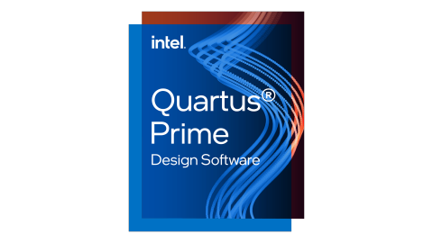
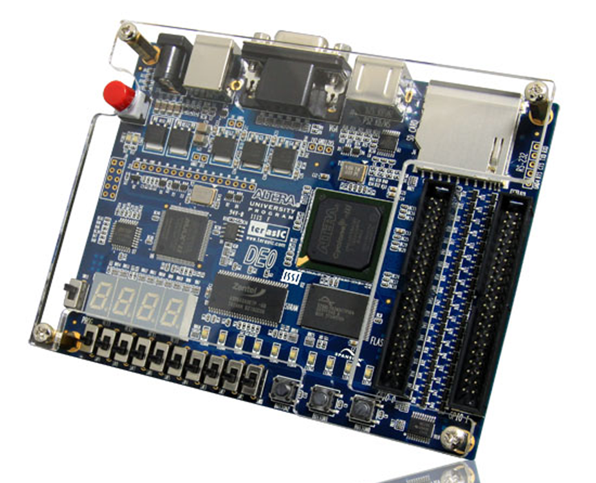
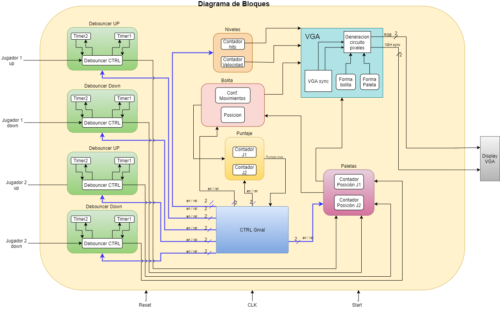
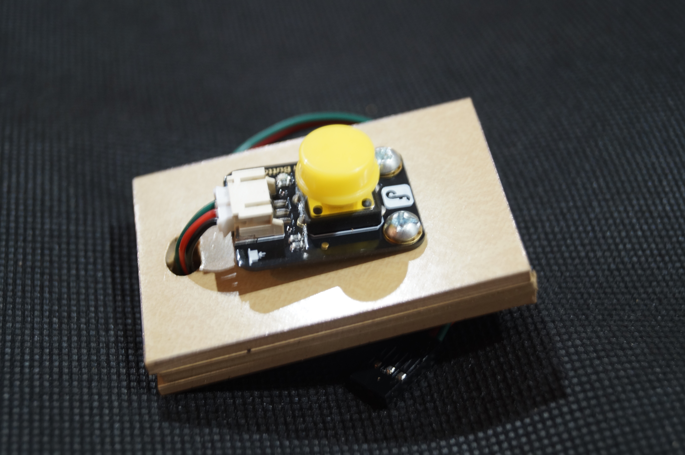

# Juego Pong en VHDL // ***VHDL Pong-Game***

El juego de __Pong__ el cual fue creado en el __año 1958__, consiste en dos jugadores, cada uno con una raqueta que se puede mover de arriba abajo, una pelota que navega el campo así como también rebota en los bordes y cuya velocidad aumenta conforme avanza el juego.

Diseño Juego Pong:
* Se implementó  en una tarjeta de desarrollo que tiene una __FPGA (Altera DE0)__.
    * [Altera DE0 Board](https://www.terasic.com.tw/cgi-bin/page/archive.pl?Language=English&CategoryNo=183&No=364&PartNo=1#contents) - ***Phased Out***
* Se diseña un __controlador VGA__ para usar el puerto VGA de la tarjeta y así visualizar en una pantalla con puerto VGA cuya resolución mínima sea de 640x480.
* Se seleccionan los __actuadores (Raquetas)__ para ser usadas por cada jugador así como también se implementa en la FPGA el hardware necesario para usar estos actuadores.

__Para la descripción de cada uno de los bloques funcionales del proyecto se usó el lenguaje de descripción de hardware VHDL.__

## Software utilizado

  

  <i>
      <b>  
        Software de diseño: Quartus II Web Edition --> Diseño / Síntesis / Soporte FPGA.
      </b>
  </i>

  <i>
      <b>  
        Software de simulación: ModelSim Altera Edition --> Functional Timming.
      </b>
  </i>

## FPGA Terasic DE0

  

    <b>
        <a 
        href="https://www.terasic.com.tw/cgi-bin/page/archive.pl?Language=English&CategoryNo=183&No=364&PartNo=1#contents"> Altera DE0 Board - (Phased Out)
        </a>
    </b>

## Diagrama de bloques del Juego

  

## Implementación  en FPGA

  

## Mandos de control

 
 

    <b>
        <a 
        href="https://www.dfrobot.com/product-73.html"> Digital Push Button
        </a>
    </b>

## Opciones Salida Pantalla

 
 

## Video Explicativo YOUTUBE

    

    <b>
        <a 
        href="https://www.youtube.com/watch?v=QU5xgUfo6AI"> Video Juego Pong
        </a>
    </b>

